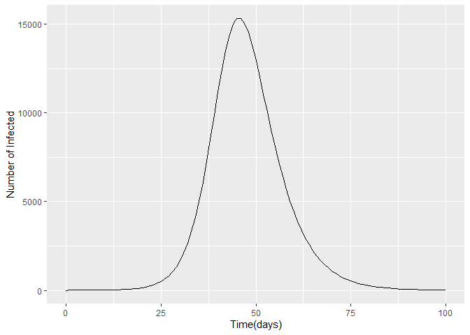
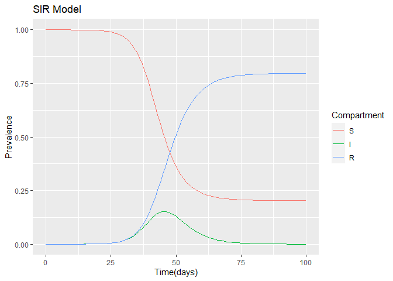
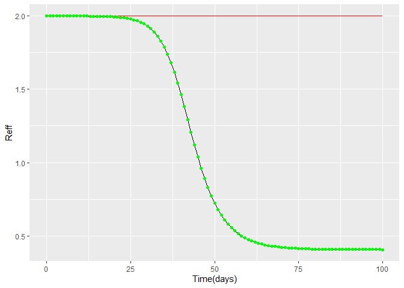

Dyanamic deterministic (SIS) model in infectious disease
================
Joshua Edefo
2024-01-09

Libraries

``` r
library(deSolve)
library(ggplot2)
```

    ## Warning: package 'ggplot2' was built under R version 4.3.2

``` r
library(reshape2)
```

    ## Warning: package 'reshape2' was built under R version 4.3.2

Inputs

``` r
N<-100000 #population

state_values<- c( S = N - 1,    # suseptible
                 I = 1,        # infected
                 R = 0)        # recovered

parameters<- c(beta = 1/2,    # infection rate days^-1 (2 days)
               gamma = 1/4)    # recovery rate days^-1 ( 4days)
               
#Timeframe ( sequence from 0 to 100 days by model)

times<- seq(0, 100, by = 1)

# Model
sir_model<- function(time, state, parameters){
  with(as.list(c(state, parameters)), {
    N<- S + I + R
    lambda = beta * I/N                # force of infection
    dS = -lambda * S                     # -forec of infection * S
    dI<- lambda * S - gamma * I          # force of infection * S - recovery rate * S
    dR = gamma * I            # recovery rate * S
    return(list(c(dS,dI,dR)))
  })
}
```

# Output

``` r
# calculation of the differential equations
output<- as.data.frame (ode(y= state_values,
                     times = times,
                     func =  sir_model,
                     parms = parameters))

output_full<- melt(as.data.frame(output), id = "time")

output_full$proportion<- output_full$value/sum(state_values)

# Plot
ggplot(data = output, aes(x=time, y = I)) +
  geom_line() +
  xlab("Time(days)")+
  ylab("Number of Infected")+
  labs("SIR Model")
```

<!-- -->

``` r
ggplot(output_full, aes(x=time, y = proportion, color = variable, gropu = variable)) +
  geom_line() +
  xlab("Time(days)") +
  ylab("Prevalence") +
  labs(colour = "Compartment", title = "SIR Model")
```

<!-- -->

``` r
output$reff<- parameters["beta"]/ parameters["gamma"] * output$S/ (output$S+output$I+output$R)
output$R0<-parameters["beta"]/ parameters["gamma"]

ggplot()+
geom_line(data= output, aes(x=time, y = reff)) +
geom_line(data= output, aes(x=time, y = R0), color = "red") +
geom_point(data= output, aes(x=time, y = reff), color = "green") +
xlab("Time(days)") +
ylab("Reff") +
labs(colour = paste ("Reproduction number levels with: Bata = ", parameters ["beta"], " and Gamma =", parameters["gamma"]))
```

<!-- -->

session information

``` r
sessionInfo()
```

    ## R version 4.3.1 (2023-06-16 ucrt)
    ## Platform: x86_64-w64-mingw32/x64 (64-bit)
    ## Running under: Windows 11 x64 (build 22631)
    ## 
    ## Matrix products: default
    ## 
    ## 
    ## locale:
    ## [1] LC_COLLATE=English_United Kingdom.utf8 
    ## [2] LC_CTYPE=English_United Kingdom.utf8   
    ## [3] LC_MONETARY=English_United Kingdom.utf8
    ## [4] LC_NUMERIC=C                           
    ## [5] LC_TIME=English_United Kingdom.utf8    
    ## 
    ## time zone: Europe/London
    ## tzcode source: internal
    ## 
    ## attached base packages:
    ## [1] stats     graphics  grDevices utils     datasets  methods   base     
    ## 
    ## other attached packages:
    ## [1] reshape2_1.4.4 ggplot2_3.4.4  deSolve_1.38  
    ## 
    ## loaded via a namespace (and not attached):
    ##  [1] vctrs_0.6.3       cli_3.6.1         knitr_1.44        rlang_1.1.1      
    ##  [5] xfun_0.40         stringi_1.7.12    generics_0.1.3    labeling_0.4.3   
    ##  [9] glue_1.6.2        colorspace_2.1-0  plyr_1.8.9        htmltools_0.5.6  
    ## [13] scales_1.2.1      fansi_1.0.4       rmarkdown_2.25    grid_4.3.1       
    ## [17] evaluate_0.21     munsell_0.5.0     tibble_3.2.1      fastmap_1.1.1    
    ## [21] yaml_2.3.7        lifecycle_1.0.3   stringr_1.5.0     compiler_4.3.1   
    ## [25] dplyr_1.1.3       Rcpp_1.0.11       pkgconfig_2.0.3   rstudioapi_0.15.0
    ## [29] farver_2.1.1      digest_0.6.33     R6_2.5.1          tidyselect_1.2.0 
    ## [33] utf8_1.2.3        pillar_1.9.0      magrittr_2.0.3    withr_2.5.0      
    ## [37] tools_4.3.1       gtable_0.3.4

\`\`\`
